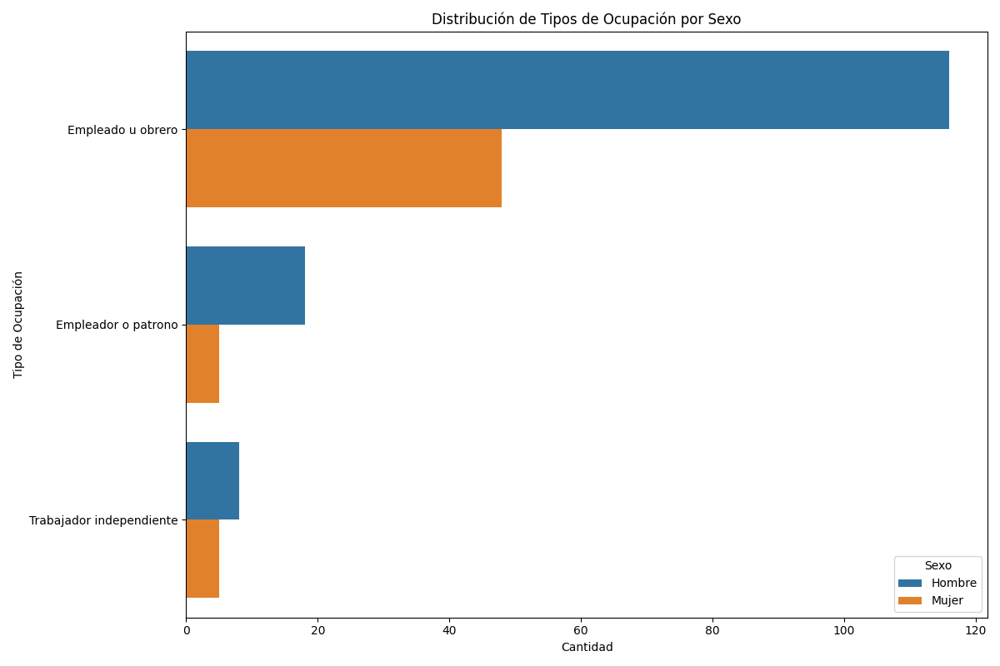
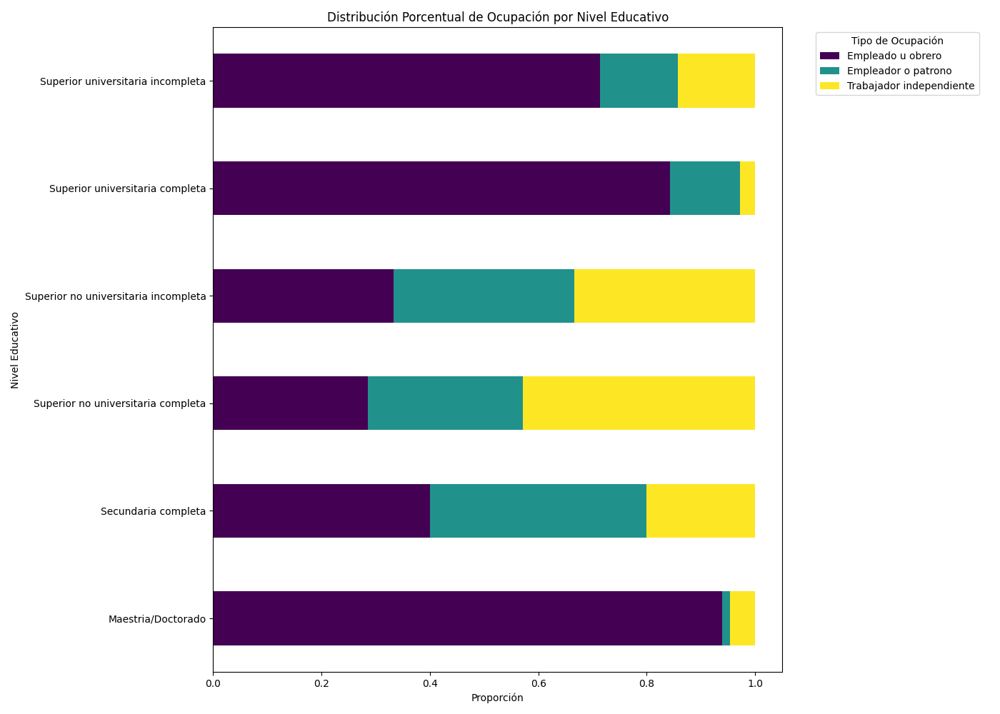
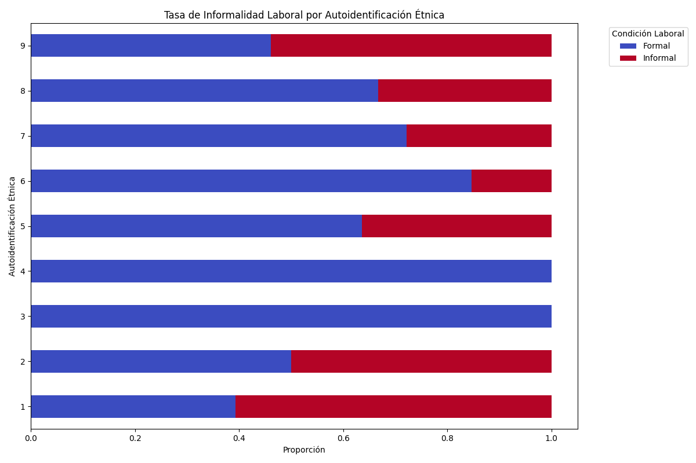
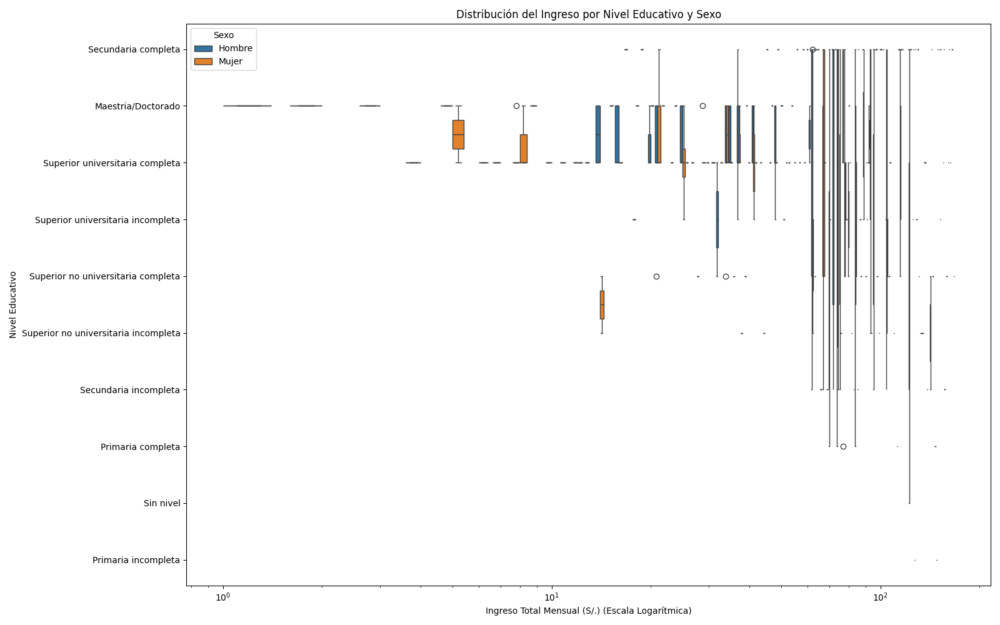
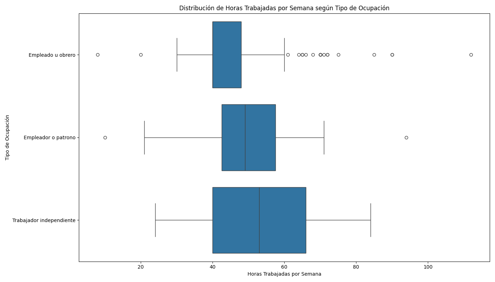

# Análisis Exploratorio de la Población Ocupada en Lima (2024-2025)

## 1. Introducción
El objetivo de este informe es explorar las relaciones entre las características demográficas y las condiciones laborales de la población ocupada en Lima. A través de un análisis visual y descriptivo, se busca identificar patrones y desigualdades en el mercado laboral que puedan informar futuras políticas públicas y estrategias de intervención.

## 2. Análisis de Ocupación por Género y Educación

El gráfico de barras agrupadas revela una marcada segregación ocupacional por género. Roles como "Trabajador del hogar" y "Trabajador no remunerado" son predominantemente femeninos, lo que sugiere una concentración de mujeres en sectores de alta vulnerabilidad y baja protección social. Por otro lado, ocupaciones como "Obrero" y "Trabajador independiente" muestran una mayor participación masculina. Esta distribución desigual es un indicador clave de las barreras estructurales que enfrentan las mujeres en el mercado laboral.

El gráfico de barras apiladas al 100% ilustra una fuerte correlación entre el nivel educativo y el tipo de ocupación. A medida que aumenta el nivel educativo, se observa una transición desde ocupaciones manuales y de baja calificación (como "Obrero" o "Trabajador del hogar") hacia roles profesionales y de mayor jerarquía (como "Empleado" o "Patrón"). Notablemente, las personas con educación superior universitaria se concentran masivamente en la categoría de "Empleado", lo que subraya el rol de la educación como vehículo de movilidad social y acceso a empleos formales y de mayor calificación.

## 3. Profundizando en la Desigualdad: Informalidad y Etnia

Este gráfico expone una de las dimensiones más críticas de la desigualdad en el mercado laboral de Lima: la informalidad y su relación con la autoidentificación étnica. Se observa que los grupos que se autoidentifican como "Otro," "Indígena," y "Negro/Moreno/Zambo" presentan tasas de informalidad considerablemente más altas en comparación con los grupos "Blanco" y "Mestizo". Esta evidencia sugiere que la vulnerabilidad laboral no se distribuye de manera homogénea, sino que afecta de forma desproporcionada a poblaciones históricamente marginadas, perpetuando ciclos de precariedad y exclusión económica.

## 4. Ingresos y Horas: Factores Clave de la Calidad del Empleo

El análisis de ingresos revela dos fenómenos centrales. Primero, existe un claro "premio a la educación": a mayor nivel educativo, la mediana del ingreso total mensual aumenta consistentemente. Segundo, se manifiesta una persistente brecha de género en todos los niveles educativos. Es alarmante observar que, incluso dentro del mismo nivel de formación, los hombres tienden a percibir ingresos superiores a las mujeres. Esta brecha se acentúa en los niveles educativos más altos, lo que indica que el acceso a la educación por sí solo no ha sido suficiente para erradicar la disparidad salarial de género.

El diagrama de cajas sobre las horas trabajadas expone una gran variabilidad en la intensidad laboral según el tipo de ocupación. Roles como "Patrón" y "Trabajador independiente" no solo muestran medianas de horas elevadas, sino también una dispersión muy amplia, sugiriendo jornadas laborales extensas y poco predecibles. En contraste, "Trabajador del hogar" y "Trabajador no remunerado" presentan jornadas más acotadas, aunque esto, combinado con los bajos ingresos, puede ser un indicador de subempleo.

## 5. Conclusiones Preliminares del Análisis Exploratorio
El análisis exploratorio de la población ocupada en Lima revela un mercado laboral profundamente segmentado y desigual. Las principales conclusiones son:
- **Segregación Estructural:** Existen fuertes barreras de género y etnia que determinan el acceso a ocupaciones de calidad. Las mujeres y las minorías étnicas se concentran en roles de mayor precariedad, informalidad y menor remuneración.
- **Retorno a la Educación con Matices:** Si bien la educación superior está asociada a mejores ingresos y ocupaciones, no logra eliminar la brecha salarial de género. Las mujeres ganan sistemáticamente menos que los hombres con el mismo nivel de formación.
- **La Informalidad como Eje de la Desigualdad:** La condición de informalidad es un factor central que agudiza las desigualdades, afectando de manera desproporcionada a las poblaciones indígenas y afrodescendientes.
- **Calidad del Empleo Variable:** La calidad del empleo, medida en ingresos y horas trabajadas, varía drásticamente entre tipos de ocupación, reflejando una estructura laboral jerárquica y poco homogénea.

Estos hallazgos subrayan la necesidad de políticas públicas integrales que no solo fomenten la creación de empleo, sino que también aborden las barreras estructurales que perpetúan la desigualdad en el mercado laboral de Lima.
