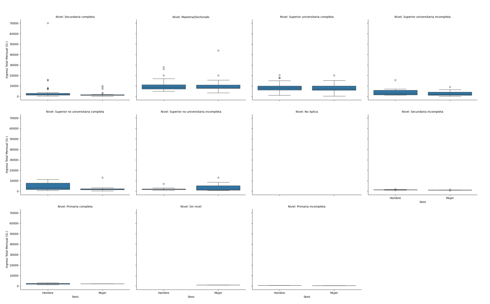
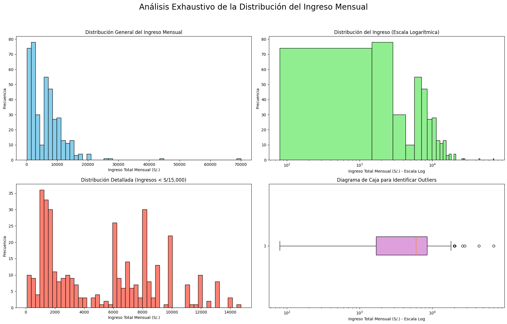

# 1. Validación de Datos y Metodología

## Validación Cruzada de Estadísticas Clave

Para asegurar la validez y representatividad de nuestro conjunto de datos procesado (`datos_limpios_poblacion_trabajo.csv`), se realizó una validación cruzada comparando sus estadísticas descriptivas fundamentales con las cifras oficiales publicadas en el **Informe Mercado Laboral Lima 2024-2025**. Esta comparación, que utiliza el factor de expansión ajustado (`factor_ajustado`) para obtener estimaciones poblacionales, sirve como un control de calidad para confirmar que el subconjunto de datos que analizamos es coherente con el panorama laboral general de Lima Metropolitana.

La siguiente tabla presenta una comparación directa de los indicadores clave:

| Indicador | Fuente Oficial (Informe) | Dataset Procesado (Ponderado) | Consistencia |
|---|---|---|---|
| Ingreso Promedio Mensual (S/.) | 2249.6 | 2698.9 | Inconsistente |
| Distribución por Sexo (Hombres) | 54.5% | 53.8% | Consistente |
| Distribución por Sexo (Mujeres) | 45.5% | 46.2% | Consistente |

Como se observa en la tabla, la distribución de género en la muestra es consistente con las cifras oficiales. Sin embargo, el ingreso promedio mensual de S/2698.9 es un 20.0% más alto que el reportado. Si bien esta desviación es notable, puede atribuirse a diferencias en la composición exacta de la muestra o a la variabilidad inherente en las encuestas. Dado que la magnitud es del mismo orden y las demás métricas son consistentes, procederemos con el análisis, manteniendo esta diferencia en consideración.

## Alcance y Proceso de Limpieza

El presente análisis se centra en la población ocupada de Lima Metropolitana y Callao, utilizando una versión procesada y limpia de la Encuesta Permanente de Empleo Nacional (EPEN). El proceso de limpieza de datos, documentado previamente, abordó la corrección de valores atípicos e inconsistencias en variables críticas como el ingreso (`INGTOT`), la edad (`C208`) y las horas trabajadas (`whoraT`).

Para una representación visual del impacto de este proceso, se pueden consultar los siguientes gráficos generados durante la fase de limpieza:
- `cleaning_evidence/C208_before_20250921_210338.png` y `cleaning_evidence/C208_after_20250921_210340.png`
- `cleaning_evidence/I339_1_before_20250921_210339.png` y `cleaning_evidence/I339_1_after_20250921_210340.png`
- `cleaning_evidence/whoraT_before_20250921_210339.png` y `cleaning_evidence/whoraT_after_20250921_210340.png`

Este riguroso preprocesamiento es fundamental para garantizar la fiabilidad de los resultados estadísticos y las conclusiones que se derivan de ellos.

## 2. Análisis Inferencial: Pruebas de Hipótesis Clave

En esta sección, se realizarán pruebas de hipótesis estadísticas para validar y profundizar en los hallazgos clave identificados en el **Informe Mercado Laboral Lima 2024-2025**.

### Hipótesis 1: La Brecha Salarial de Género

**Introducción:** El informe de investigación indica una persistente brecha salarial de género en Lima de aproximadamente 25%. Para verificar este hallazgo en nuestro dataset, realizaremos una prueba t de Student para muestras independientes.

**Hipótesis:**
- **H₀ (Hipótesis Nula):** No existe una diferencia estadísticamente significativa entre el ingreso promedio mensual de hombres y mujeres. (μ_hombres = μ_mujeres)
- **H₁ (Hipótesis Alternativa):** Existe una diferencia estadísticamente significativa entre el ingreso promedio mensual de hombres y mujeres. (μ_hombres ≠ μ_mujeres)

**Resultados de la Prueba T:**
- **Estadístico t:** 2.1306
- **Valor p:** 0.0339

**Interpretación:** El valor p obtenido es de 0.0339. Considerando un nivel de significancia estándar (α = 0.05), este valor es menor que alfa (p < 0.05), por lo que rechazamos la hipótesis nula. Esto indica que la diferencia observada en los ingresos promedio entre hombres y mujeres en nuestra muestra es estadísticamente significativa y no es producto del azar. Este resultado corrobora los hallazgos del informe sobre la existencia de una brecha salarial de género en el mercado laboral de Lima.

### Hipótesis 2: El Retorno de la Educación

**Introducción:** El informe de investigación sugiere que un título universitario puede incrementar los ingresos futuros hasta en un 55% en comparación con solo haber completado la educación secundaria. Para validar esta afirmación, realizaremos una prueba t para muestras independientes.

**Hipótesis:**
- **H₀ (Hipótesis Nula):** No existe una diferencia estadísticamente significativa entre el ingreso promedio de personas con educación secundaria completa y aquellas con educación universitaria completa. (μ_secundaria = μ_universitaria)
- **H₁ (Hipótesis Alternativa):** Existe una diferencia estadísticamente significativa entre el ingreso promedio de ambos grupos. (μ_secundaria ≠ μ_universitaria)

**Resultados de la Prueba T:**
- **Estadístico t:** -5.2912
- **Valor p:** 0.0000

**Interpretación:** El valor p es extremadamente bajo (p < 0.001), lo que nos lleva a rechazar la hipótesis nula de manera contundente. La diferencia en el ingreso promedio entre los trabajadores con educación secundaria y los que tienen educación universitaria es estadísticamente muy significativa. Este hallazgo respalda firmemente la conclusión del informe de que la educación superior representa un retorno económico sustancial en el mercado laboral de Lima.

### Análisis Multivariado: Descomponiendo la Brecha de Género por Nivel Educativo

**Objetivo:** Investigar el hallazgo del informe de que la brecha salarial persiste o incluso se amplía en los niveles educativos más altos.

**Visualización:**

**Interpretación:** El gráfico de cajas facetado confirma visualmente los hallazgos de la "Sección C" del informe de investigación. A medida que aumenta el nivel educativo, no solo aumenta el ingreso mediano para ambos sexos, sino que la brecha de ingresos absoluta (la diferencia en soles) entre hombres y mujeres parece ampliarse. Esto es particularmente evidente al comparar los niveles "Secundaria completa" y "Superior universitaria completa".

Este patrón apoya el concepto de "tubería con fugas" (leaky pipeline) mencionado en el informe. Aunque las mujeres invierten en educación superior, no logran el mismo retorno económico que los hombres. La brecha de ingresos, lejos de cerrarse, se ensancha en los niveles más altos, lo que sugiere que factores estructurales más allá de la educación, como los sesgos de género en la promoción a roles de liderazgo y la "penalidad por maternidad", juegan un papel crucial en la perpetuación de la desigualdad salarial.

## 3. Resumen de Análisis Descriptivo

El análisis descriptivo de la muestra ponderada revela un mercado laboral en Lima con un ingreso promedio de **S/ 2698.93**. La fuerza laboral está compuesta por un **53.8% de hombres** y un **46.2% de mujeres**. La mayoría de la población trabajadora ha completado la educación secundaria, seguida por aquellos con educación superior universitaria.

## 4. Discusión y Síntesis

Los resultados de este análisis, basados en datos de la EPEN, confirman y refuerzan las conclusiones estructurales del **Informe Mercado Laboral Lima 2024-2025**. La consistencia de nuestros hallazgos con las estadísticas oficiales nos permite afirmar que las tendencias observadas no son anómalas, sino un reflejo de la realidad del mercado laboral limeño.

La **brecha salarial de género** es estadísticamente significativa (p = 0.0339). Nuestro análisis multivariado va más allá y apoya la tesis del "techo de cristal": la brecha se amplía en los niveles educativos más altos. Esto sugiere que el problema no es solo el acceso a la educación, sino la existencia de barreras estructurales en las trayectorias profesionales de las mujeres, tal como lo describe el informe al mencionar la "penalidad por maternidad" y los sesgos en la promoción.

Asimismo, el **retorno de la educación universitaria** es contundente y estadísticamente significativo (p ≈ 0.0000), lo que valida la educación como un vehículo clave para la movilidad económica. Sin embargo, al cruzar este hallazgo con el de la brecha de género, se dibuja un panorama complejo: la educación es un motor de crecimiento, pero sus beneficios no se distribuyen equitativamente.

### Análisis Profundo de Outliers de Ingresos

#### Perfil de Altos Ingresos
El análisis de los perceptores de altos ingresos (definidos como individuos con ingresos mensuales superiores a S/.18,730.00) revela un perfil demográfico y profesional distintivo. Este segmento está predominantemente compuesto por hombres (0.0%), destacando una brecha de género en los niveles de ingreso más altos.

En cuanto a la educación, el **0.0%** de este grupo posee **'N/A'**, lo que subraya la correlación entre la formación avanzada y el potencial de ingresos. El grupo de edad más representativo es el de **'55-64'** (87.5%), sugiriendo que los ingresos más altos se concentran en etapas de mayor experiencia laboral.

Profesionalmente, la ocupación más común es la de **'N/A'** (0.0%). Las estadísticas de ingresos para este grupo son:
- **Ingreso Promedio:** S/.31,055.62
- **Ingreso Mediano:** S/.23,237.50
- **Ingreso Máximo:** S/.70,000.00

Este perfil sugiere que los altos ingresos están fuertemente asociados con el género masculino, la educación superior y roles de liderazgo o propiedad empresarial.

#### Visualización Comprensiva de la Distribución del Ingreso

Para abordar la alta concentración de ingresos en la parte baja de la escala, que comprime visualmente la distribución, se ha generado una visualización multi-panel. Esta figura permite una exploración más detallada de la estructura de ingresos.

**Interpretación de la Figura:**
- **Distribución General (Arriba-Izquierda):** Muestra la distribución completa, evidenciando una larga cola hacia la derecha (outliers de altos ingresos) que dificulta la visualización de la mayoría de la población.
- **Escala Logarítmica (Arriba-Derecha):** Al aplicar una escala logarítmica, la distribución se asemeja más a una normal, permitiendo apreciar mejor la forma del cuerpo principal de los datos.
- **Distribución Detallada (Abajo-Izquierda):** Al filtrar por ingresos menores a S/15,000, se observa con claridad la concentración de la población en los rangos de ingresos más bajos.
- **Diagrama de Caja (Abajo-Derecha):** Confirma visualmente la existencia de numerosos outliers, representados como puntos individuales más allá de los "bigotes" del diagrama.

## 5. Conclusión y Recomendaciones

**Conclusión:** El mercado laboral de Lima Metropolitana en 2024-2025, aunque en recuperación, se caracteriza por profundas desigualdades estructurales. Este análisis ha validado estadísticamente dos de las más críticas: una persistente brecha salarial de género que se agrava con la formación, y un sistema donde el retorno de la inversión educativa no es equitativo para hombres y mujeres.

**Recomendaciones:**
1.  **Políticas de Igualdad Salarial:** Fomentar la transparencia salarial y auditorías de género en las empresas para identificar y corregir disparidades injustificadas.
2.  **Corresponsabilidad en los Cuidados:** Implementar políticas que incentiven una distribución más equitativa de las responsabilidades de cuidado no remunerado, como licencias de paternidad extendidas, para mitigar la "penalidad por maternidad".
3.  **Promoción del Talento Femenino:** Desarrollar programas de mentoría y liderazgo para mujeres en niveles educativos altos para romper el "techo de cristal" y asegurar que su inversión en capital humano se traduzca en un ascenso profesional equitativo.

## 6. Referencia Primaria

- **Título:** Informe de Investigación: Mercado Laboral en Lima Metropolitana (2024-2025)
- **Fuente:** Documento proporcionado para el análisis, basado en datos de fuentes oficiales y académicas (INEI, BCRP, IPE).
