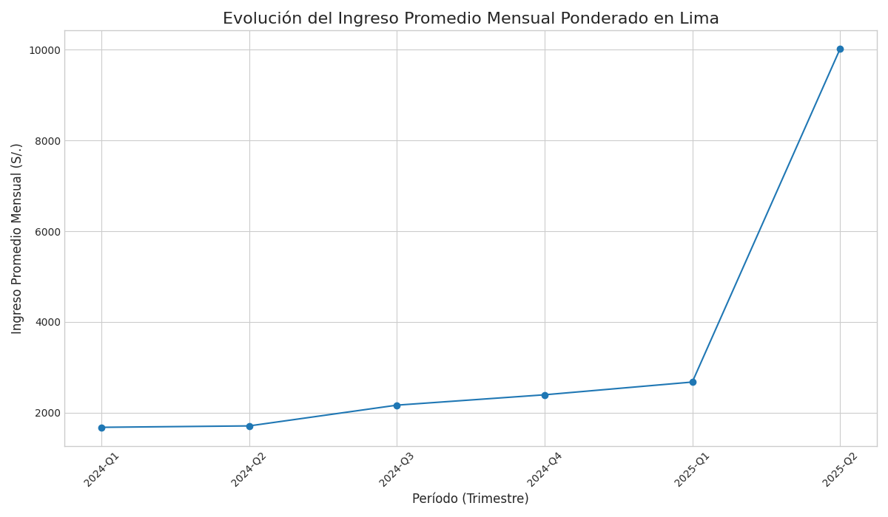

# Informe de Análisis Exploratorio de Datos (EDA) - Lima

Este informe presenta los hallazgos iniciales del análisis de los datos trimestrales para Lima, con un enfoque en las estadísticas ponderadas y la evolución temporal.

## 1. Análisis Descriptivo Ponderado (General)

Estadísticas calculadas sobre el conjunto de datos completo (6 trimestres), utilizando el `factor_expansion` para reflejar la realidad poblacional de Lima.

- **Ingreso Promedio Mensual Ponderado:** S/. 4,754.10
- **Edad Promedio Ponderada:** 43.7 años

### Distribución de Género Ponderada:
| Género   |   % Población |
|:---------|--------------:|
| Hombre   |       53.8252 |
| Mujer    |       46.1748 |

## 2. Sección de Análisis Temporal

Esta sección muestra cómo han evolucionado las métricas clave a lo largo de los 6 trimestres analizados.

### Evolución del Ingreso Promedio Mensual Ponderado

La siguiente tabla muestra el ingreso promedio mensual ponderado para cada trimestre:

| periodo   |   Ingreso Promedio (S/.) |
|:----------|-------------------------:|
| 2024-Q1   |                  1676.61 |
| 2024-Q2   |                  1707.83 |
| 2024-Q3   |                  2165.19 |
| 2024-Q4   |                  2393.6  |
| 2025-Q1   |                  2674.38 |
| 2025-Q2   |                 10014.6  |

El siguiente gráfico ilustra esta tendencia visualmente:

## 3. Conclusiones Preliminares del EDA

El análisis inicial muestra una base de datos consistente que permitirá un análisis temporal robusto. El uso del factor de expansión es crucial para obtener una imagen precisa de la población de Lima. La sección de análisis temporal revela fluctuaciones en el ingreso promedio, lo que justifica un estudio más profundo de la estacionalidad y las tendencias en las fases de modelado.
