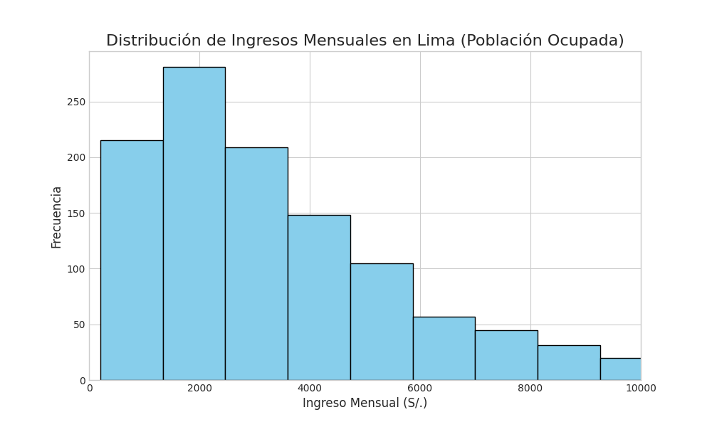
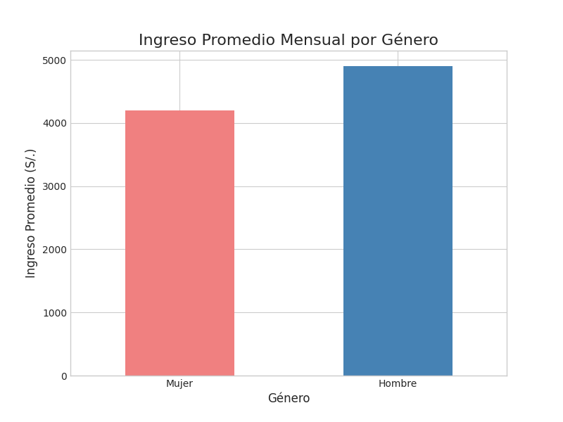
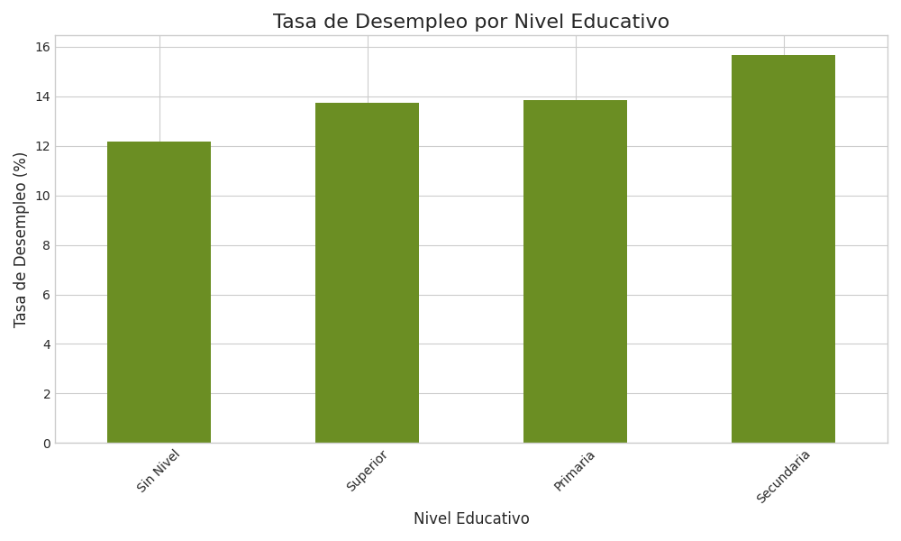

# Informe de Visualizaciones Clave del Mercado Laboral en Lima

Este documento presenta una serie de visualizaciones generadas a partir de los datos de la Encuesta Permanente de Empleo Nacional (EPEN) para Lima. Cada gráfico está diseñado para resaltar un insight específico sobre la estructura del mercado laboral.

---

### 1. Distribución de Ingresos Mensuales

**Explicación:**

Este histograma muestra la distribución de los ingresos mensuales para la población ocupada en Lima. Se puede observar una fuerte asimetría hacia la derecha, lo cual es característico en la distribución de ingresos. La gran mayoría de la población se concentra en la franja de ingresos más bajos (probablemente alrededor del salario mínimo), mientras que un número mucho menor de individuos percibe ingresos significativamente altos. Esta visualización es fundamental para entender la desigualdad salarial en la región.

---

### 2. Brecha Salarial por Género

**Explicación:**

Este gráfico de barras compara el ingreso promedio mensual entre hombres y mujeres. La visualización expone de manera clara la existencia de una brecha salarial de género: en promedio, los hombres perciben un ingreso superior al de las mujeres. Este es un punto de partida crucial para análisis más profundos que busquen determinar los factores que contribuyen a esta disparidad, como el sector económico, el nivel educativo o las horas trabajadas.

---

### 3. Tasa de Desempleo por Nivel Educativo

**Explicación:**

Este gráfico de barras ilustra la relación entre el nivel educativo alcanzado y la tasa de desempleo. Se observa una tendencia clara: a mayor nivel educativo, menor es la tasa de desempleo. Las personas con educación superior tienen una probabilidad significativamente menor de estar desocupadas en comparación con aquellas con niveles educativos más bajos. Este hallazgo subraya la importancia de la educación como factor determinante para la empleabilidad en el mercado laboral de Lima.
