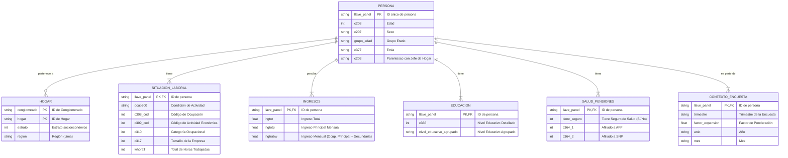

# Modelo Conceptual de Datos - Encuesta de Empleo de Lima

Este documento describe el modelo conceptual de datos diseñado para estructurar la información de la encuesta de empleo. El objetivo es organizar las variables en entidades lógicas para facilitar el análisis y el modelado.

---

### 1. Visión General y Entidades

El modelo se centra en la persona encuestada como la entidad principal. Las demás entidades representan diferentes facetas de la vida de esa persona, como su situación demográfica, laboral, educativa y de salud.

A continuación se definen las entidades principales:

- **Persona:** El individuo encuestado. Contiene atributos demográficos básicos.
- **Hogar:** La unidad familiar a la que pertenece la persona.
- **Situación Laboral:** Describe la condición de actividad de la persona (ocupado, desocupado, inactivo), su ocupación y las características de su empleo.
- **Ingresos:** Agrupa todas las variables relacionadas con los ingresos monetarios y no monetarios.
- **Educación:** Contiene información sobre el nivel educativo alcanzado por la persona.
- **Salud y Pensiones:** Describe la afiliación a sistemas de seguro de salud y de pensiones.
- **Contexto Encuesta:** Metadatos de la encuesta, como el trimestre, el conglomerado y el factor de expansión.

---

### 2. Diagrama Entidad-Relación (ERD)

El siguiente diagrama, generado con Mermaid, visualiza las relaciones entre las entidades definidas.

---

### 3. Descripción de Relaciones

- **PERSONA - HOGAR:** Una `PERSONA` pertenece a un `HOGAR`. Múltiples personas pueden pertenecer al mismo hogar. La relación es uno a muchos.
- **PERSONA - SITUACION_LABORAL, INGRESOS, etc.:** Cada `PERSONA` tiene exactamente una `SITUACION_LABORAL`, un registro de `INGRESOS`, `EDUCACION`, etc. Estas no son entidades separadas en el dataset final, sino agrupaciones lógicas de las columnas que describen a la persona. La relación es uno a uno.

Este modelo conceptual sirve como guía para entender la estructura de los datos y para informar el diseño de los modelos de machine learning y los análisis en el dashboard.
